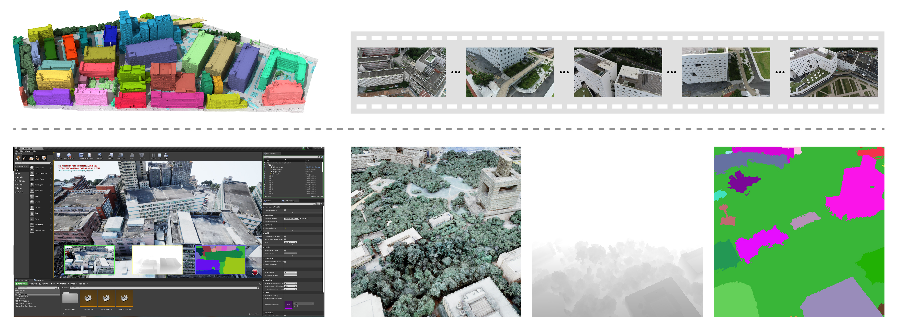

<center>A glance of synthetic (top) and real (bottom) scenes in UrbanScene3D.</center>

## <center>Abstract</center>
We present UrbanScene3D, a large-scale data platform for research of urban scene perception and reconstruction. 
UrbanScene3D contains over 128k high-resolution images covering 16 scenes including 
large-scale real urban regions and synthetic cities with 136 km<sup>2</sup> area in total. 
The dataset also contains high-precision LiDAR scans and hundreds of image sets with different observation patterns, 
which provide a comprehensive benchmark to design and evaluate aerial path planning and 3D reconstruction algorithms. 
In addition, the dataset, which is built on Unreal Engine and Airsim simulator together with 
the manually annotated unique instance label for each building in the dataset, 
enables the generation of all kinds of data, e.g., 2D depth maps, 2D/3D bounding boxes, and 3D point cloud/mesh segmentations, etc. 
The simulator with physical engine and lighting system not only produce variety of data
but also enable users to simulate cars or drones in the proposed urban environment for future research.


UrbanScene3D also provides the building instance ID for each environment (top left), 
4K aerial videos that are aimed at the real scene acquisition (top right), 
and a simulator built on Unreal Engine and AirSim (bottom).


## <center>Acknowledgements</center>
This work was supported in parts by NSFC (62161146005, U21B2023, U2001206), GD Talent Program (2019JC05X328), DEGP Key Project (2018KZDXM058, 2020SFKC059), Shenzhen Science and Technology Program (RCJC20200714114435012, JCYJ20210324120213036), and Guangdong Laboratory of Artificial Intelligence and Digital Economy (SZ).

## <center>Copyright</center>
UrbanScene3D is publicly accessible for non-commercial uses only. Permission is granted to use the data only if you agree:
- The dataset is provided "AS IS". Despite our best efforts to assure accuracy, we disclaim all liability for any mistakes or omissions;
- All works that utilize this dataset including any partial use must include a reference to it. Please correctly cite our ECCV22 publication in research papers using the information provided below;
- You refrain from disseminating this dataset or any altered variations;
- You are not permitted to utilize this dataset or any derivative work for any commercial endeavors;
- We reserve all rights that are not explicitly granted to you.

## <center>BibTeX</center>
```
@article{lin2022urbanscene3d,
  title={Capturing, Reconstructing, and Simulating: the UrbanScene3D Dataset},
  author={Lin, Liqiang and Liu, Yilin and Hu, Yue and Yan, Xingguang and Xie, Ke and Huang, Hui},
  journal={arXiv preprint arXiv:2107.04286},
  year={2022}
}
```

## <center>Referenes</center>
[1] Smith, N., Moehrle, N., Goesele, M., Heidrich, W.: Aerial path planning for urban
scene reconstruction: a continuous optimization method and benchmark. ACM
Trans. on Graphics (Proc. SIGGRAPH Asia) pp. 183:1–183:15 (2018)

[2] Zhou, X., Xie, K., Huang, K., Liu, Y., Zhou, Y., Gong, M., Huang, H.: Offsite aerial
path planning for efficient urban scene reconstruction. ACM Trans. on Graphics
(Proc. SIGGRAPH Asia) pp. 192:1–192:16 (2020)

[3] Zhang, H., Yao, Y., Xie, K., Fu, C.W., Zhang, H., Huang, H.: Continuous aerial
path planning for 3D urban scene reconstruction. ACM Trans. on Graphics (Proc.
SIGGRAPH Asia) pp. 225:1–225:15 (2021)
